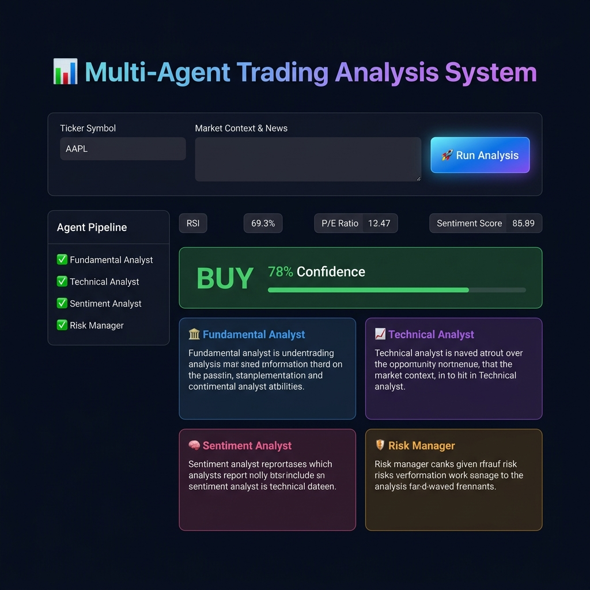

# 📊 Multi-Agent Trading Analysis System

> A production-ready, multi-agent AI system that performs comprehensive trading analysis for any stock or crypto asset using **LangChain**, **LangGraph**, and **NVIDIA NIM** — surfaced through a polished **Streamlit** web interface.

---

## 🖼️ App Preview



*The dashboard shows the live agent pipeline, specialist report cards, and the final Buy/Hold/Sell recommendation with confidence score.*

---

## 🏗️ Architecture

```
START
  └─▶ Supervisor Agent (LLM-based dynamic routing)
        ├─▶ 🏦 Fundamental Analyst  → Valuation, growth, financial health
        ├─▶ 📈 Technical Analyst    → Price action, RSI, MACD, EMA crossovers
        ├─▶ 🧠 Sentiment Analyst    → Market psychology from news/context
        └─▶ 🛡️ Risk Manager         → VaR, volatility, Kelly position sizing
              └─▶ Supervisor (synthesis)
                    └─▶ END → Buy / Hold / Sell + Confidence %
```

| Component | Technology |
|-----------|-----------|
| Orchestration | LangGraph `StateGraph` |
| LLM | NVIDIA NIM · `stepfun-ai/step-3.5-flash` |
| Agent Framework | LangChain LCEL chains |
| Structured Output | Pydantic `TradingDecision` model |
| Web Interface | Streamlit |
| Tracing (optional) | LangSmith |

---

## 📁 Project Structure

```
multi-agent-trading-analysis/
├── main.py            # Streamlit web interface
├── graph.py           # LangGraph StateGraph definition
├── agents.py          # Node functions for all 5 agents
├── tools.py           # 4 mock analysis tools (stocks + crypto)
├── prompts.py         # System prompts for all agents
├── state.py           # AgentState TypedDict
├── assets/
│   └── app_screenshot.png   # App preview image
├── requirements.txt   # Python dependencies
├── .env.example       # Environment variable template
└── README.md          # This file
```

---

## ⚙️ Setup & Installation

### 1. Clone the repository

```bash
git clone https://github.com/<your-username>/Multi-Agent-Trading-Analysis-System.git
cd Multi-Agent-Trading-Analysis-System
```

### 2. Create a virtual environment

```bash
python -m venv venv
source venv/bin/activate        # macOS / Linux
# venv\Scripts\activate         # Windows
```

### 3. Install dependencies

```bash
pip install -r requirements.txt
```

### 4. Set up environment variables

```bash
cp .env.example .env
```

Open `.env` in your editor and fill in your API key:

```env
NVIDIA_API_KEY=nvapi-xxxxxxxxxxxxxxxxxxxx
```

#### 🔑 Obtaining an NVIDIA API Key

1. Visit **[https://build.nvidia.com/](https://build.nvidia.com/)**
2. Sign up / log in with your NVIDIA account
3. Navigate to **API Keys** → **Generate New Key**
4. Copy the key (starts with `nvapi-`) and paste it into your `.env`
5. The `stepfun-ai/step-3.5-flash` model is available on the **free tier** with generous rate limits

---

## 🚀 Running the Application

```bash
streamlit run main.py
```

The app opens automatically at **[http://localhost:8501](http://localhost:8501)**

---

## 🎯 How to Use the App

### Step 1 — Enter a Ticker Symbol

In the **"Ticker Symbol"** input field, type the asset you want to analyse.

| Asset Class | Example Tickers |
|-------------|----------------|
| 📈 US Equities | `AAPL` · `MSFT` · `TSLA` · `NVDA` · `GOOGL` |
| 📈 Indian Equities | `RELIANCE` · `TCS` · `INFY` · `HDFC` |
| 🪙 Crypto | `BTC` · `ETH` · `SOL` · `BNB` · `ADA` · `DOGE` |

> The ticker is case-insensitive — `aapl`, `AAPL`, and `Aapl` all work.

---

### Step 2 — Add Market Context *(Optional but recommended)*

Paste recent **news headlines**, **analyst commentary**, or **market notes** into the **"Market Context & News"** text area. This text is fed directly to the **Sentiment Analyst** agent.

**Example inputs:**

```
Apple beats Q3 earnings expectations by 8%. iPhone 16 Pro demand exceeds supply.
Fed signals rate cut in September — bullish for growth stocks.
Analysts at Goldman Sachs upgrade AAPL to Strong Buy with $230 price target.
Institutional buying detected; options flow heavily bullish.
```

```
Bitcoin ETF approval drives record institutional inflows.
BTC hash rate hits all-time high indicating strong network security.
Regulatory clarity improving in US and EU — bullish adoption signal.
Some profit-taking expected after 40% monthly gain.
```

> Leave this field blank for a purely data-driven analysis without sentiment input.

---

### Step 3 — Run the Analysis

Click the **"🚀 Run Analysis"** button.

The system will:
1. ✅ **Supervisor** decides which specialist to call first
2. 🏦 **Fundamental Analyst** evaluates valuation & financial health
3. 📈 **Technical Analyst** evaluates price action & momentum indicators
4. 🧠 **Sentiment Analyst** evaluates market psychology from your news input
5. 🛡️ **Risk Manager** evaluates volatility, VaR, and position sizing
6. 🤖 **Supervisor** synthesises all 4 reports into a final recommendation

> ⏱️ Typical analysis time: **30–90 seconds** depending on API response speed.

---

### Step 4 — Read the Results

#### 🏁 Final Recommendation Badge
A colour-coded badge displays the final decision:

| Badge | Meaning |
|-------|---------|
| 🟢 **BUY** | Strong positive signal — consider entering a long position |
| 🟡 **HOLD** | Mixed or neutral signals — maintain current position |
| 🔴 **SELL** | Negative signal — consider reducing or exiting exposure |

The **Confidence %** (0–100) tells you how strongly the AI convicts in its recommendation:
- **80–100%** → Very high conviction
- **60–79%** → Moderately confident
- **40–59%** → Mixed signals, cautious
- **Below 40%** → Low conviction, high uncertainty

#### 🔬 Specialist Reports
Four expandable report cards show the detailed findings from each analyst:
- **🏦 Fundamental** — P/E, earnings growth, debt, ROE (stocks) or NVT, TVL, dev activity (crypto)
- **📈 Technical** — RSI, MACD, EMA crossovers, support/resistance levels
- **🧠 Sentiment** — Compound sentiment score, bullish/bearish signal count
- **🛡️ Risk** — Annualised volatility, VaR, Sharpe ratio, Kelly position size

#### 🔧 Raw JSON Inspector
Click **"Raw JSON Output — Full State"** at the bottom to inspect the complete agent state, including all raw tool data and intermediate AI messages.

---

## 💡 Example Workflows

### Quick Stock Scan (No Context)
1. Type `NVDA` in the ticker field
2. Leave context blank
3. Click **Run Analysis**
4. Review the Buy/Hold/Sell recommendation based purely on fundamental + technical + risk data

### Full-Context Crypto Deep Dive
1. Type `SOL` in the ticker field
2. Paste: *"Solana hits new ATH in daily transactions. Developer activity at record highs. Firedancer upgrade imminent. Institutional ETF filing submitted. Bullish momentum across all on-chain metrics."*
3. Click **Run Analysis**
4. The Sentiment Analyst detects strongly bullish signals and factors them into the final synthesis

---

## 🔬 Agent Details

### Supervisor Agent
- **Role:** Central CIO routing all specialist calls and synthesising final output
- **Tech:** LLM-based dynamic routing → Pydantic `TradingDecision` structured output

### Fundamental Analyst
- **Tool:** `mock_fundamental_analysis(ticker)`
- **Equity Metrics:** P/E ratio, EPS, revenue growth %, profit margins, debt-to-equity, ROE, FCF yield, dividend yield
- **Crypto Metrics:** NVT ratio, TVL, developer commits (30d), active addresses, staking yield, protocol revenue

### Technical Analyst
- **Tool:** `mock_technical_analysis(ticker)`
- **Metrics:** RSI-14, MACD histogram, Bollinger Band position, EMA-20/50/200, golden cross detection, volume change %, ATR, support/resistance levels

### Sentiment Analyst
- **Tool:** `mock_sentiment_analysis(context_text)`
- **Metrics:** Compound sentiment score (−1 to +1), bullish/bearish keyword hits, fear/greed proxy index

### Risk Manager
- **Tool:** `calculate_risk_score(ticker, position_size=100000)`
- **Metrics:** Daily + annualised volatility, VaR-95 (1-day), max drawdown proxy, beta, Sharpe ratio, liquidity score, Kelly fraction, recommended position size USD

---

## 🔍 LangSmith Tracing *(Optional)*

Uncomment these lines in `main.py` to enable full trace visibility in [LangSmith](https://smith.langchain.com/):

```python
os.environ["LANGCHAIN_TRACING_V2"] = "true"
os.environ["LANGCHAIN_API_KEY"] = "ls__your_key"
os.environ["LANGCHAIN_PROJECT"] = "multi-agent-trading-analysis"
```

Or add to your `.env`:

```env
LANGCHAIN_TRACING_V2=true
LANGCHAIN_API_KEY=ls__xxxxxxxxxxxxxxxxxxxxxxxxxxxxxxxx
LANGCHAIN_PROJECT=multi-agent-trading-analysis
```

---

## ⚠️ Disclaimer

This system uses **mock data tools** — no real market data is fetched. All metrics are deterministically generated from the ticker string for demonstration purposes.

> **This is not financial advice.** Do not use this system for real trading decisions.

---

## 📜 License

MIT License — see [LICENSE](LICENSE) for details.

---

<div align="center">
  Built with ❤️ using LangChain · LangGraph · NVIDIA NIM · Streamlit
</div>